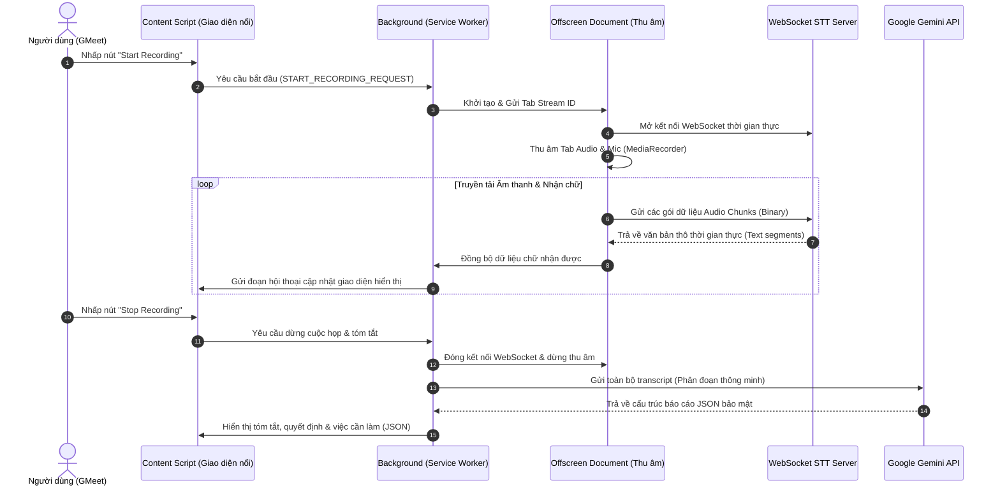
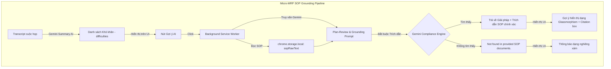

# 📑 Scribe AI: Chrome Extension Ghi Âm & Tóm Tắt Cuộc Họp Thông Minh (Manifest V3)

**Scribe AI** là một Chrome Extension cao cấp được thiết kế để tự động hóa quy trình ghi âm, chuyển chữ thời gian thực (Real-time Transcription) và tóm tắt thông minh các cuộc họp trực tuyến (như Google Meet) sử dụng kiến trúc bảo mật **Bring Your Own Key (BYOK)**.

Hệ thống hoạt động mượt mà bằng cách kết hợp sức mạnh thu âm luồng hệ thống của Chrome, luồng truyền tải thời gian thực qua WebSocket và các mô hình ngôn ngữ lớn tiên tiến nhất từ Google Gemini (từ phiên bản `2.0` cho tới `3.1-flash-lite-preview`).

---

## 🏗️ Kiến Trúc Hệ Thống (Architecture Flow)

Kiến trúc hệ thống được thiết kế tối ưu hóa hiệu năng và bảo mật theo chuẩn **Manifest V3**, phân rã thành các module độc lập tương tác qua hệ thống tin nhắn nội bộ (`chrome.runtime.sendMessage`):

---

## ⚙️ Các Thành Phần Chính & Nguyên Lý Hoạt Động

### 1. Audio Capture & Offscreen Document (Thu âm & Xử lý Luồng âm)
* **Thách thức**: Trình duyệt Chrome Manifest V3 tự động ngắt (suspend) Service Worker chạy ngầm sau 30 giây không hoạt động, làm gián đoạn việc thu âm cuộc họp kéo dài.
* **Nguyên lý hoạt động**:
  * Khi người dùng bắt đầu ghi âm, **Service Worker (Background)** sẽ khởi tạo một **Offscreen Document** (`offscreen/offscreen.html`).
  * Tài liệu ẩn này chạy trên một cửa sổ ảo độc lập, được cấp quyền truy cập đầy đủ vào các API DOM như `MediaRecorder` và luồng âm thanh hệ thống qua `chrome.tabCapture`.
  * Điều này đảm bảo quá trình thu âm diễn ra liên tục, không bao giờ bị gián đoạn hay bị ngủ đông trong suốt hàng giờ cuộc họp.

### 2. Live Transcription & WebSocket Server (Chuyển đổi Giọng nói thành Văn bản)
* **Nguyên lý hoạt động**:
  * `Offscreen Document` thiết lập kết nối **WebSocket** thời gian thực đến máy chủ chuyển đổi giọng nói (STT Server).
  * Luồng âm thanh thu âm từ Tab cuộc họp được chia nhỏ thành các gói nhị phân (binary chunks) có độ trễ cực thấp và đẩy liên tục lên STT Server.
  * STT Server xử lý và gửi ngược lại các đoạn văn bản thô (raw text segments).
  * Tiện ích lưu trữ các phân đoạn này vào **IndexedDB** nội bộ (`services/db.js`) để đảm bảo không bị mất dữ liệu ngay cả khi tab bị crash.

### 3. Smart Boundary Chunking & Word Backtracking (Chia nhỏ Transcript Thông minh)
* **Thách thức**: Các cuộc họp dài có lượng văn bản rất lớn, vượt quá giới hạn token đầu vào (context window) hoặc giới hạn phản hồi của API Gemini, đồng thời việc cắt văn bản tùy ý sẽ làm vỡ từ hoặc mất ngữ nghĩa.
* **Nguyên lý hoạt động**:
  * Trước khi gửi đến Gemini, transcript được phân tích và chia nhỏ bằng thuật toán **Word Backtracking** (`splitTranscriptIntoChunks`).
  * Nếu văn bản vượt quá giới hạn an toàn (`MAX_CHUNK_CHAR_LIMIT = 20000` ký tự), thuật toán sẽ dò ngược lại ký tự khoảng trắng gần nhất để cắt văn bản, đảm bảo không có từ nào bị cắt đôi ở ranh giới phân mảnh.

### 4. Rolling Summarization (Tóm tắt Cuốn chiếu & Hợp nhất)
* **Nguyên lý hoạt động**:
  * Tiện ích áp dụng quy trình tóm tắt cuốn chiếu (rolling summary) đối với các cuộc họp siêu dài:
    1. **Baseline Phase**: Gửi phân đoạn 1 để tạo tóm tắt nền tảng.
    2. **Rolling Phase**: Đối với các phân đoạn tiếp theo, hệ thống gửi kèm bản tóm tắt JSON hiện tại cùng phân đoạn văn bản mới. Gemini sẽ tự động cập nhật, hợp nhất thông tin mới vào cấu trúc cũ.
    3. **Polishing Phase**: Thực hiện một lượt quét cuối cùng để chuẩn hóa, loại bỏ các chủ đề trùng lặp và định dạng lại danh sách việc cần làm một cách chuyên nghiệp.

### 5. Lựa chọn Model Linh Hoạt & Đa Dạng (Dynamic Model Selector)
* Tích hợp tính năng **BYOK (Bring Your Own Key)** bảo vệ quyền riêng tư tuyệt đối. API Key được lưu an toàn trong `chrome.storage.local`.
* Giao diện Popup cho phép người dùng thay đổi linh hoạt dòng model AI của Google tùy theo nhu cầu:
  * **`gemini-3.1-flash-lite-preview` (Mặc định)**: Tốc độ phản hồi cực nhanh, xử lý JSON cấu trúc cao hoàn hảo.
  * **`gemini-2.0-flash` & `gemini-2.5-flash`**: Các dòng model tối ưu cho tốc độ và hiệu năng miễn phí.
  * **`gemini-2.5-pro`**: Mô hình thông minh cao cấp nhất xử lý các cuộc họp kỹ thuật phức tạp.

---

## 🌟 Các Tính Năng Nổi Bật Mới (Core Features)

Tiện ích đã được nâng cấp mạnh mẽ với các tính năng cốt lõi vượt trội:

### 1. Chế độ Thu Thập Phụ Đề Trực Tiếp ("Lấy theo Google Meet")
* **Không cần Audio input**: Hoạt động hoàn hảo mà không cần mở kết nối WebSocket STT hay thu âm hệ thống, tiết kiệm tối đa băng thông và tài nguyên CPU.
* **Cơ chế Active Node Tracking**: Giải quyết triệt để lỗi "auto-correct" (Google STT liên tục thay đổi nội dung từ ngữ trong cùng một thẻ trước khi người nói dừng lại). ScribeAI gán nhãn duy nhất (`blockKey`) cho mỗi khối phát biểu, cho phép ghi đè in-place văn bản theo thời gian thực trực tiếp trên bảng điều khiển **Live logs** và IndexedDB/Local Storage.

### 2. Tự Động Kích Hoạt Phụ Đề Thông Minh (Agnostic CC Auto-Enabler)
* **Vượt qua rào cản ngôn ngữ**: Không cần quan tâm người dùng thiết lập ngôn ngữ giao diện Google Meet là tiếng Việt ("Bật phụ đề"), tiếng Anh ("Turn on captions"), hay bất kỳ tiếng nào khác.
* **SVG Icon Fingerprinting**: Hệ thống tự động quét bản đồ tọa độ SVG của nút Closed Caption chuẩn Material Design (`M19 4H5...`) trên thanh công cụ và mô phỏng sự kiện `.click()` để tự động kích hoạt phụ đề ngay khi người dùng bắt đầu ghi âm.

### 3. Xuất Báo Cáo Công Việc sang Excel (Action Items Excel Export)
* **Tích hợp nút "Xuất Excel"**: Xuất hiện trực quan ngay trong tab **AI Summary** tại phần báo cáo nhiệm vụ.
* **Chuẩn hóa UTF-8 BOM**: Tự động chèn ký tự Byte Order Mark (`\uFEFF`) để đảm bảo các ký tự tiếng Việt có dấu được hiển thị hoàn hảo, không bao giờ bị lỗi font khi mở trực tiếp bằng Microsoft Excel.
* **Báo cáo cấu trúc**: File xuất ra gồm 4 cột chuyên nghiệp: `assignee` (Người nhận việc), `task` (Nội dung công việc), `deadline` (Hạn chót), và cột chọn trạng thái `Status` (To Do, In Progress, Done).

### 4. Ưu Tiên Phản Hồi Tiếng Việt (Vietnamese-First JSON Schema)
* Cấu trúc Prompt hệ thống ép buộc Gemini trả về định dạng JSON thuần Việt 100% giúp báo cáo tổng kết cuộc họp đạt độ tự nhiên cao, mạch lạc và sát nghĩa nhất với văn hóa hội họp tại Việt Nam.

### 5. Bút Thần Kỳ - Magic Pencil (Screen Crop & Translate) ✨
* **Trích xuất & Dịch thuật hình ảnh tức thì**: Tích hợp công cụ chụp ảnh màn hình thông minh bằng cách nhấp chọn biểu tượng **Cây đũa thần (🪄)** trên thanh tiêu đề của bảng điều khiển.
* **Quy trình tối ưu trải nghiệm (UX)**:
  * **Chụp ảnh sạch**: Tự động ẩn bảng điều khiển Scribe AI trong `150ms` trước khi chụp ảnh màn hình bằng `captureVisibleTab` để tránh bảng điều khiển che khuất nội dung trang web.
  * **Khung vẽ Glowing Neon**: Vẽ vùng chọn tùy ý bằng chuột trái qua một lớp canvas phủ toàn màn hình với hiệu ứng làm tối nền và viền sáng neon tím (`#a855f7`) cao cấp.
  * **Thanh công cụ nổi (Floating Action Bar)**: Tự động tính toán vị trí nổi tối ưu phía trên vùng chọn để cung cấp các tác vụ dịch thuật nhanh hoặc sao chép chữ OCR.
  * **Dịch thuật đa ngôn ngữ qua Gemini Vision**: Hỗ trợ nhận diện và dịch trực tiếp sang các ngôn ngữ **Tiếng Việt**, **English**, **Français** thông qua sức mạnh xử lý đa phương tiện của mô hình Gemini Vision gửi an toàn từ background worker.
  * **Kết quả Glassmorphism & Hủy nhanh**: Hiển thị kết quả trong một hộp thoại nổi thiết kế Glassmorphism tuyệt đẹp có hỗ trợ copy 1-click, đồng thời hỗ trợ phím tắt `Escape` để hủy bỏ chế độ chụp màn hình tức thì.

### 6. Quản Lý Quy Trình SOP & Đường Ống Micro-MRP Pipeline 🤖
* **Tích hợp Cơ sở Tri thức SOP (Knowledge Base)**:
  * Cung cấp tab chuyên biệt **SOP Docs** ngay trên giao diện Popup của Chrome Extension.
  * Hỗ trợ người dùng nhập liệu tự do (paste văn bản thô) hoặc tải lên trực tiếp các tệp tin quy trình như `.txt`, `.md`, `.csv` với cơ chế đọc file thời gian thực tiện lợi.
  * Tự động lưu trữ và đồng bộ hóa cơ sở tri thức SOP an toàn trong bộ nhớ cục bộ của tiện ích (`chrome.storage.local`).
* **Khai thác Khó khăn từ Cuộc họp (Extract Difficulties)**:
  * Khi hoàn tất ghi âm, luồng xử lý của Gemini sẽ phân tích sâu transcript để tự động bóc tách các vấn đề thực tiễn, rủi ro, và khó khăn phát sinh trong cuộc họp dựa trên JSON Schema chuẩn Việt.
* **Gợi ý Giải pháp Tuân thủ (Grounded Compliance Agent)**:
  * Bên cạnh mỗi khó khăn được liệt kê trong tab **AI Summary**, hệ thống tự động sinh một nút tương tác **🤖 Gợi ý AI**.
  * Khi nhấp chọn nút này, hệ thống sẽ kích hoạt đường ống **Micro-MRP SOP Grounding Pipeline** chạy ngầm để truy vấn chéo Gemini.
  * Gemini hoạt động dưới vai trò là một **SOP Compliance Agent (Tác nhân Kiểm soát Quy trình)**, thực hiện đối soát khó khăn với cơ sở dữ liệu SOP đã lưu.
* **Nguyên tắc Chống Hallucination (Strict Citation Enforcement)**:
  * **Grounding Tuyệt đối**: Nếu không có giải pháp trong SOP, hệ thống phản hồi chính xác `"Not found in provided SOP documents."`, triệt tiêu hoàn toàn khả năng AI tự bịa đặt giải pháp.
  * **Trích dẫn Minh bạch**: Đối với các giải pháp hợp lệ, Gemini bắt buộc phải trích xuất và trả về **nguyên văn đoạn câu văn quy trình thực tế** từ tệp SOP để làm bằng chứng xác thực (`citation`), hiển thị trực quan dưới dạng hộp trích dẫn viền nét đứt xanh lá cây bắt mắt.

### 7. Tạm Dừng & Tiếp Tục Thu Âm Thông Minh (Pause & Resume) ⏸️
* **Kiểm soát linh hoạt cuộc họp**: Thêm nút tạm dừng (Pause) chuyên dụng khi đang ghi âm cho cả 2 nguồn: ghi âm qua WebSocket STT và lấy phụ đề từ Google Meet.
* **Nguyên lý hoạt động**:
  * Khi người dùng nhấn nút Tạm Dừng (⏸️), trạng thái cuộc họp chuyển thành `PAUSED`.
  * **Chế độ WebSocket (Audio capture)**: Tạm dừng gửi các gói nhị phân audio chunks lên server STT để tiết kiệm băng thông và bảo vệ quyền riêng tư khi thảo luận nội bộ ngoài lề.
  * **Chế độ Lấy phụ đề (Google Meet)**: Tự động bỏ qua việc quét và lưu trữ các Closed Caption mới trên DOM.
  * Khi nhấn Tiếp Tục (Resume), hệ thống khôi phục trạng thái hoạt động bình thường tức thì và tiếp tục nối tiếp hội thoại một cách liền mạch.

### 8. Xuất Nhật Ký Trực Tiếp Đa Định Dạng (Multi-Format Live Logs Export) 📤
* **Xuất trực tiếp ngay trong tab Live logs**: Tích hợp các nút xuất dữ liệu sang các tệp tin phổ biến bao gồm `.txt`, `.pdf`, `.docx`, `.doc` trực tiếp bên dưới bảng điều khiển Live logs.
* **Tự động hóa hiển thị thông minh**: Hàng nút xuất file sẽ tự động ẩn đi khi nhật ký trống và chỉ hiển thị khi có ít nhất một dòng log xuất hiện, đảm bảo giao diện tinh gọn, sạch sẽ.
* **Định dạng tối ưu**:
  * **`.txt`**: Định dạng văn bản thuần UTF-8 rõ ràng.
  * **`.doc`/`.docx`**: Định dạng Rich HTML chất lượng cao tương thích tốt với Microsoft Word, giữ nguyên cấu trúc font chữ, màu sắc và tiêu đề đẹp mắt.
  * **`.pdf`**: Bản in sạch sẽ và tối giản qua cửa sổ in chuyên dụng của trình duyệt Chrome.

---

## 🛠️ Hướng Dẫn Cài Đặt & Khởi Động Dự Án

Dự án đã được tự động hóa quy trình khởi động cục bộ, giúp bạn thiết lập chỉ trong vài giây.

### 📋 Bước 1: Thiết Lập Môi Trường
1. Yêu cầu máy tính đã cài đặt **NodeJS** (phiên bản 18+ khuyến nghị).
2. Tải mã nguồn dự án về máy tính của bạn.
3. Sở hữu một khóa **Google Gemini API Key** (tạo miễn phí tại [Google AI Studio](https://aistudio.google.com/)).

### ⚡ Bước 2: Khởi Động Nhanh Với `run.bat`
Không cần phải mở terminal thủ công và gõ các lệnh phức tạp, bạn chỉ cần thực hiện:
1. Tìm tệp **`run.bat`** ở thư mục gốc của dự án.
2. Kích đúp chuột (Double-click) vào tệp này.
3. Một cửa sổ Terminal chuyên dụng sẽ tự động được mở và khởi chạy máy chủ WebSocket STT Server (`node server.js`) trên cổng mặc định `8080`.

### 🧩 Bước 3: Nạp Tiện Ích Vào Trình Duyệt Chrome
1. Mở trình duyệt Google Chrome và truy cập đường dẫn: `chrome://extensions/`.
2. Bật chế độ nhà phát triển (**Developer mode**) ở góc trên cùng bên phải.
3. Nhấp vào nút **Load unpacked** (Tải tiện ích đã giải nén).
4. Tìm và chọn thư mục chứa mã nguồn của extension này (`gemini-meeting-recorder-extension`).
5. Tiện ích **Gemini Scribe** sẽ lập tức xuất hiện trên thanh công cụ của bạn!

---

## 🎮 Quy Trình Chạy Chức Năng (End-to-End Workflow)

1. **Cấu hình ban đầu**:
   * Bấm vào biểu tượng Extension trên thanh công cụ.
   * Nhập **Gemini API Key** của bạn.
   * Chọn model ưa thích (khuyên dùng `gemini-3.1-flash-lite-preview`).
   * Bấm **Save Settings**.
2. **Kích hoạt ghi âm**:
   * Truy cập vào một phòng họp Google Meet bất kỳ.
   * Bảng điều khiển nổi **Gemini Scribe** sẽ tự động xuất hiện ở góc màn hình.
   * Chọn chế độ thu dữ liệu tại menu lựa chọn **Capture Mode**:
     * **Mặc định (WebSocket)**: Thu âm song song cả micro và âm thanh cuộc họp.
     * **Lấy theo Google Meet**: Sử dụng thuật toán quét phụ đề DOM thời gian thực siêu nhẹ.
   * Bấm **Start Recording** để bắt đầu. Hệ thống sẽ tự động bật phụ đề CC của Google Meet và hiển thị cuộc thoại trực tiếp tại tab **Live logs**.
3. **Quản lý phiên ghi âm**:
   * Trong lúc ghi âm, bạn có thể bấm **Hủy bỏ** để dừng ngay lập tức, dọn dẹp sạch bộ nhớ đệm IndexedDB/Chrome Storage và xóa trạng thái ghi âm mà không để lại dữ liệu rác.
4. **Tóm tắt & Xuất báo cáo**:
   * Bấm **Stop & Summary** khi cuộc họp kết thúc.
   * Tiện ích sẽ đóng offscreen/observer, kích hoạt luồng AI Rolling Summary của Gemini và tự động chuyển sang tab **AI Summary**.
   * Đọc báo cáo tóm tắt cuộc họp và bấm nút **Xuất Excel** để lưu danh sách Task & Action Items về máy tính định dạng `.csv` siêu mượt!

