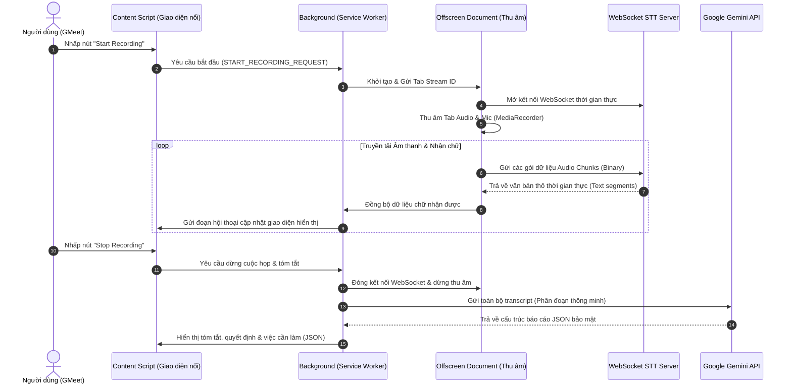

# 📑 Scribe AI: Chrome Extension Ghi Âm & Tóm Tắt Cuộc Họp Thông Minh (Manifest V3)

**Scribe AI** là một Chrome Extension cao cấp được thiết kế để tự động hóa quy trình ghi âm, chuyển chữ thời gian thực (Real-time Transcription) và tóm tắt thông minh các cuộc họp trực tuyến (như Google Meet) sử dụng kiến trúc bảo mật **Bring Your Own Key (BYOK)**.

Hệ thống hoạt động mượt mà bằng cách kết hợp sức mạnh thu âm luồng hệ thống của Chrome, luồng truyền tải thời gian thực qua WebSocket và các mô hình ngôn ngữ lớn tiên tiến nhất từ Google Gemini (từ phiên bản `2.0` cho tới `3.1-flash-lite-preview`).

---

## 🏗️ Kiến Trúc Hệ Thống (Architecture Flow)

Kiến trúc hệ thống được thiết kế tối ưu hóa hiệu năng và bảo mật theo chuẩn **Manifest V3**, phân rã thành các module độc lập tương tác qua hệ thống tin nhắn nội bộ (`chrome.runtime.sendMessage`):

---

## ⚙️ Các Thành Phần Chính & Nguyên Lý Hoạt Động

### 1. Audio Capture & Offscreen Document (Thu âm & Xử lý Luồng âm)
* **Thách thức**: Trình duyệt Chrome Manifest V3 tự động ngắt (suspend) Service Worker chạy ngầm sau 30 giây không hoạt động, làm gián đoạn việc thu âm cuộc họp kéo dài.
* **Nguyên lý hoạt động**:
  * Khi người dùng bắt đầu ghi âm, **Service Worker (Background)** sẽ khởi tạo một **Offscreen Document** (`offscreen/offscreen.html`).
  * Tài liệu ẩn này chạy trên một cửa sổ ảo độc lập, được cấp quyền truy cập đầy đủ vào các API DOM như `MediaRecorder` và luồng âm thanh hệ thống qua `chrome.tabCapture`.
  * Điều này đảm bảo quá trình thu âm diễn ra liên tục, không bao giờ bị gián đoạn hay bị ngủ đông trong suốt hàng giờ cuộc họp.

### 2. Live Transcription & WebSocket Server (Chuyển đổi Giọng nói thành Văn bản)
* **Nguyên lý hoạt động**:
  * `Offscreen Document` thiết lập kết nối **WebSocket** thời gian thực đến máy chủ chuyển đổi giọng nói (STT Server).
  * Luồng âm thanh thu âm từ Tab cuộc họp được chia nhỏ thành các gói nhị phân (binary chunks) có độ trễ cực thấp và đẩy liên tục lên STT Server.
  * STT Server xử lý và gửi ngược lại các đoạn văn bản thô (raw text segments).
  * Tiện ích lưu trữ các phân đoạn này vào **IndexedDB** nội bộ (`services/db.js`) để đảm bảo không bị mất dữ liệu ngay cả khi tab bị crash.

### 3. Smart Boundary Chunking & Word Backtracking (Chia nhỏ Transcript Thông minh)
* **Thách thức**: Các cuộc họp dài có lượng văn bản rất lớn, vượt quá giới hạn token đầu vào (context window) hoặc giới hạn phản hồi của API Gemini, đồng thời việc cắt văn bản tùy ý sẽ làm vỡ từ hoặc mất ngữ nghĩa.
* **Nguyên lý hoạt động**:
  * Trước khi gửi đến Gemini, transcript được phân tích và chia nhỏ bằng thuật toán **Word Backtracking** (`splitTranscriptIntoChunks`).
  * Nếu văn bản vượt quá giới hạn an toàn (`MAX_CHUNK_CHAR_LIMIT = 20000` ký tự), thuật toán sẽ dò ngược lại ký tự khoảng trắng gần nhất để cắt văn bản, đảm bảo không có từ nào bị cắt đôi ở ranh giới phân mảnh.

### 4. Rolling Summarization (Tóm tắt Cuốn chiếu & Hợp nhất)
* **Nguyên lý hoạt động**:
  * Tiện ích áp dụng quy trình tóm tắt cuốn chiếu (rolling summary) đối với các cuộc họp siêu dài:
    1. **Baseline Phase**: Gửi phân đoạn 1 để tạo tóm tắt nền tảng.
    2. **Rolling Phase**: Đối với các phân đoạn tiếp theo, hệ thống gửi kèm bản tóm tắt JSON hiện tại cùng phân đoạn văn bản mới. Gemini sẽ tự động cập nhật, hợp nhất thông tin mới vào cấu trúc cũ.
    3. **Polishing Phase**: Thực hiện một lượt quét cuối cùng để chuẩn hóa, loại bỏ các chủ đề trùng lặp và định dạng lại danh sách việc cần làm một cách chuyên nghiệp.

### 5. Lựa chọn Model Linh Hoạt & Đa Dạng (Dynamic Model Selector)
* Tích hợp tính năng **BYOK (Bring Your Own Key)** bảo vệ quyền riêng tư tuyệt đối. API Key được lưu an toàn trong `chrome.storage.local`.
* Giao diện Popup cho phép người dùng thay đổi linh hoạt dòng model AI của Google tùy theo nhu cầu:
  * **`gemini-3.1-flash-lite-preview` (Mặc định)**: Tốc độ phản hồi cực nhanh, xử lý JSON cấu trúc cao hoàn hảo.
  * **`gemini-2.0-flash` & `gemini-2.5-flash`**: Các dòng model tối ưu cho tốc độ và hiệu năng miễn phí.
  * **`gemini-2.5-pro`**: Mô hình thông minh cao cấp nhất xử lý các cuộc họp kỹ thuật phức tạp.

---

## 🛡️ Thiết Kế Bảo Mật & Phòng Chống Tấn Công (Security Constraints)

Hệ thống được thiết kế với các cơ chế phòng ngự nghiêm ngặt:
* **Prompt Injection Defense**: Toàn bộ dữ liệu transcript thu được từ cuộc họp được bao bọc chặt chẽ bên trong các thẻ XML `<transcript>...</transcript>`. Hệ thống thiết lập chỉ thị bảo mật cấp hệ thống (System Instructions) yêu cầu Gemini bỏ qua mọi câu lệnh điều hướng, yêu cầu giả danh hoặc thay đổi hành vi nằm bên trong transcript.
* **Mã hóa hiển thị API Key**: Khóa Gemini API Key được ẩn đi (`type="password"`) trên giao diện cấu hình và lưu trực tiếp trong bộ nhớ cục bộ của trình duyệt, không bao giờ gửi qua bất kỳ máy chủ trung gian nào khác.
* **Kiểm soát ngữ cảnh (Context Validation)**: Ngăn chặn triệt để lỗi `Extension context invalidated` khi extension cập nhật bằng cách bao bọc các cuộc gọi API bằng bộ lọc trạng thái chủ động, hướng dẫn người dùng F5 an toàn khi phát hiện đứt kết nối tiện ích.

---

## 🚀 Hướng Dẫn Sử Dụng Nhanh

1. **Cấu hình ban đầu**:
   * Nhấp vào biểu tượng Extension, nhập **Gemini API Key** của bạn.
   * Chọn model mong muốn (khuyên dùng mặc định `gemini-3.1-flash-lite-preview`).
   * Điền địa chỉ WebSocket của STT Server (ví dụ: `ws://localhost:8080/stt`).
   * Bấm **Save Settings**.
2. **Trong cuộc họp**:
   * Truy cập trang Google Meet bất kỳ.
   * Bảng điều khiển **Gemini Scribe** sẽ tự động hiển thị ở góc màn hình.
   * Bấm **Start Recording** để bắt đầu. Bạn sẽ thấy văn bản cuộc họp xuất hiện trực tiếp (Live Transcript).
   * Khi cuộc họp kết thúc, bấm **Stop Recording** để nhận bản báo cáo thông minh gồm: Chủ đề chính, Quyết định cuối cùng và Danh sách công việc (Action Items) được phân bổ chi tiết!
